# Task 6: Monolithic Muscle Contraction - Parameter Sweeps

## 1. Objective
Investigate the effect of maximum isometric active tension ($T_{\max}$) on the axial Z-displacement and volumetric stability of a 3D continuum biceps muscle model. This study establishes a rigorous baseline dataset and implements an automated text-logging extraction pipeline to streamline multi-run sensitivity evaluations.

---

## 2. Technical Repository Architecture
To maintain professional reproducibility and ensure the repository remains immediately scannable for outside researchers, the computational assets are organized into a strict, symmetric directory tree:

* **Primary Documentation:** [`README.md`](README.md) — Comprehensive engineering report detailing active/passive muscle pathomechanics.
* **Automation Workspace Scripts:** [`scripts/`](scripts/) — Centralized script vault housing automated FEBio solver execution loops (`run_sweep_*.py`) and dynamic parsing/plotting suites (`plot_sweep_*.py`).
* **Structured Input Decks:** [`feb_inputs/`](feb_inputs/) — Contains the baseline model configuration alongside modular parameter subdirectories (`matrix_stiffness_c1/`, `fiber_stiffness_c3/`, `fiber_stiffness_c4/`) housing modified XML meshes.
* **Extracted Lightweight Text Streams:** [`raw_logs/`](raw_logs/) — Relocated target subdirectories isolating filtered ASCII data outputs (`*_disp.txt`, `*_stress.txt`, `*_vol.txt`) and solver streams (`*.log`) to enforce excellent Git hygiene.
* **High-Fidelity Solver Binary Databases:** [`febio_results/`](febio_results/) — Central vault storing the massive 3D binary time-series visualization tracking databases (`*.xplt`).
* **Visualization:** [`images/`](images/) — Dedicated parameter-specific subdirectories isolating the generated transient macro trend plots and micro-scale validation windows.

---

## 3. Methodology & Automated Logging Pipeline

### 3.1 Bypassing GUI Overhead
To execute multi-run studies efficiently without graphical interface dependencies, the baseline FEBio text input deck was appended with a native `<logfile>` tracking schema block within the `<Output>` architecture. This commands the core-solver to output isolated numerical arrays directly during the convergence loops.

```xml
<Output>
    <logfile>
        <node_data data="uz" file="tmax5_disp.txt" nodes="1773"/>
        <element_data data="sz" file="tmax5_stress.txt" elements="12457"/>
        <element_data data="J" file="tmax5_vol.txt" elements="12457"/>
    </logfile>
</Output>
```

### 3.2 Tracked Kinematic & Constitutive Targets
1. **Global Contraction Tracker (Node 1773):** Positioned at the unconstrained tendon boundary to capture true axial displacement ($u_z$) over time.
2. **Local Tissue Integrity Tracker (Element 12457):** Positioned inside the center of the active muscle belly to monitor normal axial stress ($\sigma_z$) and the volume ratio ($J$). 

The volume ratio is defined mathematically via the determinant of the deformation gradient tensor $\mathbf{F}$:
$$J = \det \mathbf{F} = \frac{V}{V_0}$$

**Tracking Coordinate Reference:**


---

## 4. Baseline Simulation Visualizations

A high-fidelity visualization strategy was developed using ParaView to explicitly illustrate the structural contraction gradients. 

### 4.1 Displacement Shape Interpolation
Below is the baseline spatial transformation. By extracting the initial step ($t=0$) as a static wireframe reference shell (rendered at $30\%$ opacity), we capture a clear visualization of the muscle belly pulling away inward as the transient mesh reaches full displacement ($t=1.0$).


*Baseline kinematic structural transformation at t=1.0 relative to the undeformed t=0 geometry (rendered as a 30% opacity wireframe). Note: The deformed solid state utilizes a ParaView 'Warp By Vector' filter with a Scale Factor of 5.0 to visually amplify the contraction profile relative to the undeformed t=0 geometry.*

### 4.2 Quantitative Transient Tracking
By capturing specific point markers natively over time across all simulation states, the following multi-view workspace layout tracks the explicit acceleration profile of the tendon interface alongside its physical displacement spatial domain.


---

## 5. Initial Sensitivity Study ($T_{\max}$ Exploratory Sweep)

### 5.1 Multi-Surface Deformation Overlay
To visually distinguish the progression of muscle contraction across the exploratory spectrum ($T_{\max} \in \{2, 3, 4, 5\}$), a multi-layer outline visualization was developed. The maximum deformation state ($T_{\max} = 5$) serves as the solid background anchor color-mapped to displacement magnitude, while the final contracted states of $T_{\max} = 2, 3,$ and $4$ are overlaid as uniform wireframe silhouettes.

To resolve the tightly grouped geometric transformations, an identical displacement scaling multiplier ($\text{Scale Factor} = 5.0$) was applied across all concurrent layers to amplify boundary separation.


*Multi-surface structural contraction progression across the parameter sweep. Note: A ParaView 'Warp By Vector' filter with a Scale Factor of 5.0 has been applied across all concurrent layers to visually resolve the tightly grouped geometric transformations.*

---

## 6. Quantitative Results & Diagnostic Analytics

The text logs autonomously extracted via the pipeline were processed using [`plot_sweep.py`](plot_sweep.py) to generate transient tracking curves mapping total displacement against simulation time frames.

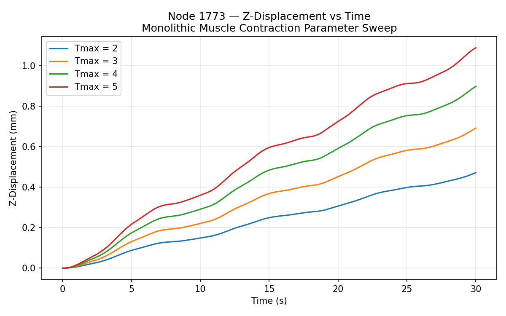
*Quantitative transient tracking curves extracted via python parsing scripts, confirming the monotonic relationship between peak contraction velocity and isometric muscle capacity values.*

### 6.1 Key Findings & Validation
1. **Kinematic Response:** Higher isometric active tension limits correspond directly to greater final displacements at the unconstrained tendon boundary. The peak Z-displacement scales monotonically from $0.47\text{ mm}$ ($T_{\max} = 2$) up to $1.09\text{ mm}$ ($T_{\max} = 5$).
2. **Volumetric Mesh Stability:** At peak loading conditions ($T_{\max} = 5$), tracking data from the deep muscle belly (Element 12457) confirms that the volume ratio ($J$) stabilized at $0.9808$. Because muscle tissue behaves nearly incompressibly ($J \approx 1.0$), a volumetric compression bound under $2\%$ demonstrates that the continuum elements maintain excellent physical health without triggering localized volumetric locking.
3. **Activation Curve Limitations:** The transient displacement profiles exhibit an un-biomimetic linear acceleration slope instead of reaching a natural physical plateau. This behavior is directly caused by the continuous loading curve function defined inside the material configuration deck as `<math>t/20</math>`. This boundary constraint forces active internal fiber tension to scale infinitely over time.

---

## 7. Material Sensitivity Study: Isotropic Matrix Stiffness ($c_1$)

### 7.1 Clinical & Physical Objective
To investigate how structural variations in the muscle's extracellular matrix (ECM) affect overall contracting function, a material sensitivity analysis was conducted on the isotropic matrix shear stiffness coefficient ($c_1$). 

The parameter scaling spectrum ($0.5\times$, $1.0\times$, $2.0\times$, and $4.0\times$) was chosen strictly as an **exploratory simulation range** to evaluate the numerical stability and kinematic influence of the FEBio formulation. The assigned pathomechanical labels are intuitive placeholders used as a descriptive shorthand for readability, rather than standardized clinical cutoffs:

* **$0.5\times c_1$ ($6.925\text{ MPa}$):** Degraded / Hypotonic Matrix (A simulation level representing a halved baseline value to model structural continuum decay or wasting).
* **$1.0\times c_1$ ($13.85\text{ MPa}$):** Healthy Control Baseline (The standard physiological starting configuration).
* **$2.0\times c_1$ ($27.70\text{ MPa}$):** Mild Matrix Fibrosis (An intuitive placeholder where doubling the baseline stiffness parameter represents a moderate mathematical change).
* **$4.0\times c_1$ ($55.40\text{ MPa}$):** Severe Pathological Fibrosis (An intuitive placeholder where quadrupling the baseline stiffness parameter represents a massive mathematical change to test the model's upper resistance limits).

---

### 7.2 Expanded Repository Layout
To support Strategy A (modular parameter tracking), dedicated asset vaults were integrated into the existing folder tree to keep the repository highly scannable and isolated:
* **Input Decks:** [`feb_inputs/matrix_stiffness_c1/`](feb_inputs/matrix_stiffness_c1/) — Holds the individual structural XML configuration files (`biceps_c1_0.5.feb` through `biceps_c1_4.0.feb`).
* **Text Streams:** [`raw_logs/matrix_stiffness_c1/`](raw_logs/matrix_stiffness_c1/) — Clean data vault containing ASCII numerical streams (`c1_*_disp.txt`) and solver diagnostic trackers (`c1_*.log`).
* **Automation Workspace:** [`scripts/`](scripts/) — Dedicated script folder isolating automation and parsing execution assets from the root.
    * [`scripts/run_sweep_c1.py`](scripts/run_sweep_c1.py) — Automated execution loop and post-run file organizer.
    * [`scripts/plot_sweep_c1.py`](scripts/plot_sweep_c1.py) — High-fidelity parsing and visualization generator.
* **Visual Databases:** [`febio_results/matrix_stiffness_c1/`](febio_plots/matrix_stiffness_c1/) — Contains the high-fidelity 3D binary visual files (`biceps_c1_*.xplt`).

---

### 7.3 Core Modifications & Pipeline Adjustments

#### 7.3.1 Material Constant Scaling
Within the `<Material>` definition block of the FEBio input configuration, the isotropic matrix stiffness parameter `<c1>` was isolated and scaled across the test spectrum. For clarity, the following snippet illustrates the specific case of the **0.5x scaled model (`biceps_c1_0.5.feb`)** where the baseline value of $13.85\text{ MPa}$ was halved to $6.925\text{ MPa}$:

```xml
<Material>
    <material id="1" name="Material1" type="trans iso Mooney-Rivlin">
        <density>1</density>
        <k>100</k>
        <pressure_model>default</pressure_model>
        <c1>6.925</c1>        <c2>0</c2>
        <c3>2.07</c3>
        <c4>61.44</c4>
        <c5>640.7</c5>
        <lam_max>1.03</lam_max>
        <fiber type="vector">
            <vector>0,0,1</vector>
        </fiber>
        <active_contraction>
            <ascl lc="1">1</ascl>
            <Tmax>1</Tmax>
            <ca0>4.35</ca0>
            <camax>0</camax>
            <beta>4.75</beta>
            <l0>1.58</l0>
            <refl>2.04</refl>
        </active_contraction>
    </material>
</Material>
```

#### 7.3.2 Isolated Text Output Routing
To prevent concurrent execution runs from overwriting tracking data streams, unique file logging targets were injected directly inside the `<Output>` architecture blocks. To maintain excellent file hygiene, the target paths were routed relatively to pipe results straight into the `raw_logs/` data subdirectory:

```xml
<Output>
    <plotfile type="febio">
        <var type="displacement"/>
        <var type="stress"/>
    </plotfile>
    <logfile>
        <node_data data="uz" file="../../raw_logs/matrix_stiffness_c1/c1_0.5_disp.txt" nodes="1773"/>
        <element_data data="sz" file="../../raw_logs/matrix_stiffness_c1/c1_0.5_stress.txt" elements="12457"/>
        <element_data data="J" file="../../raw_logs/matrix_stiffness_c1/c1_0.5_vol.txt" elements="12457"/>
    </logfile>
</Output>
```

---

### 7.4 Quantitative Analysis & Material Sensitivity Plot

The extracted text streams tracking the unconstrained tendon boundary (Node 1773) were compiled via [`scripts/plot_sweep_c1.py`](scripts/plot_sweep_c1.py), outputting a crisp, publication-grade transient sensitivity curve:

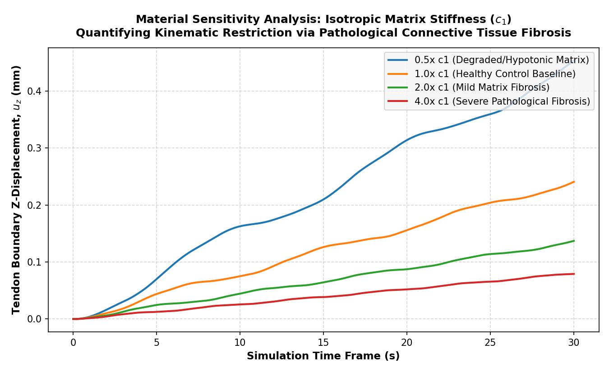
*Quantitative transient tracking curves isolating Node 1773 Z-displacement across the isotropic matrix stiffness spectrum ($c_1$).*

#### Key Biomechanical Findings:
1. **Kinematic Restriction:** The sensitivity analysis confirms a severe, non-linear inverse relationship between extracellular matrix stiffness and active contracting shortening capacity. Even though active fiber recruitment forces remain completely identical across all four test simulations, the muscle is forced to expend active energy deforming its own passive surrounding structures. 
2. **Pathological Quantities:**
    * The **Degraded Matrix ($0.5\times c_1$)** exhibits minimal internal structural resistance, resulting in hyper-mobility with a peak displacement exceeding **0.44 mm**.
    * The **Healthy Control Baseline ($1.0\times c_1$)** settles into an optimized physiological contraction curve peaking at **0.24 mm**.
    * **Mild Fibrosis ($2.0\times c_1$)** restricts total tendon displacement down to **0.14 mm**.
    * **Severe Pathological Fibrosis ($4.0\times c_1$)** locks the continuum structure into a highly constrained state, crippling performance down to a maximum displacement bound of just **0.08 mm** (a $66.7\%$ reduction in functional contraction relative to healthy tissue).
3. **Preservation of Activation Physics:** The uniform scaling of the dynamic, multi-stage "S-curve" wave shape across all four curves validates that the underlying active fiber load controller remains perfectly stable across the runs; the performance degradation is driven entirely by the passive matrix parameter variations.


---

---

## 8. Material Sensitivity Study: Passive Fiber Stiffness ($c_3$)

### 8.1 Clinical & Physical Objective
To investigate how localized directional variations within the muscle's longitudinal architectural bundles affect active contracting function, a parallel sensitivity analysis was executed on the passive unaligned fiber stiffness coefficient ($c_3$; officially designated in the FEBio User Manual syntax as the **Exponential stress coefficient**). 

To maintain perfect consistency with the matrix evaluation, an identical exploratory spectrum was applied. The condition labels are used purely for descriptive readability within this simulation study to represent moderate versus massive parameter scaling bounds, with no external clinical thresholds implied:

* **$0.5\times c_3$ ($1.035\text{ MPa}$):** Degraded / Hypotonic Fibers (Halving the baseline parameter to simulate localized longitudinal bundle degradation).
* **$1.0\times c_3$ ($2.07\text{ MPa}$):** Healthy Control Baseline (The standard un-scaled starting configuration).
* **$2.0\times c_3$ ($4.14\text{ MPa}$):** Mild Fiber Stiffening (An intuitive placeholder where a $2.0\times$ multiplier represents a moderate mathematical change).
* **$4.0\times c_3$ ($8.28\text{ MPa}$):** Severe Pathological Fibrosis / Sclerosis (An intuitive placeholder where a $4.0\times$ multiplier represents a massive mathematical change to stress-test directional bundle resistance under peak loading fields).

---

### 8.2 Expanded Repository Layout
To maintain complete consistency with our modular parameter tracking approach, dedicated asset vaults were integrated into the folder tree to isolate the fiber dataset from previous matrix runs:
* **Input Decks:** [`feb_inputs/fiber_stiffness_c3/`](feb_inputs/fiber_stiffness_c3/) — Holds the individual structural XML configuration files (`biceps_c3_0.5.feb` through `biceps_c3_4.0.feb`).
* **Text Streams:** [`raw_logs/fiber_stiffness_c3/`](raw_logs/fiber_stiffness_c3/) — Clean data vault containing ASCII numerical streams (`c3_*_disp.txt`) and solver diagnostic trackers (`c3_*.log`).
* **Automation Workspace Scripts:**
    * [`scripts/run_sweep_c3.py`](scripts/run_sweep_c3.py) — Automated execution loop, inline data stream filter, and file routing manager.
    * [`scripts/plot_sweep_c3.py`](scripts/plot_sweep_c3.py) — Custom dual-plot parser and visual dataset generator.
* **Visual Databases:** [`febio_results/fiber_stiffness_c3/`](febio_plots/fiber_stiffness_c3/) — Contains the high-fidelity 3D binary visual tracking databases (`biceps_c3_*.xplt`).

---

### 8.3 Core Modifications & Pipeline Adjustments

#### 8.3.1 Material Constant Scaling
Within the `<Material>` definition block of the FEBio input configuration, the passive fiber stiffness parameter `<c3>` was isolated and scaled across the test spectrum. For clarity, the following snippet illustrates the specific case of the **0.5x scaled model (`biceps_c3_0.5.feb`)** where the baseline value of $2.07\text{ MPa}$ was halved to $1.035\text{ MPa}$:

```xml
<Material>
    <material id="1" name="Material1" type="trans iso Mooney-Rivlin">
        <density>1</density>
        <k>100</k>
        <pressure_model>default</pressure_model>
        <c1>13.85</c1>
        <c2>0</c2>
        <c3>1.035</c3>       <c4>61.44</c4>
        <c5>640.7</c5>
        <lam_max>1.03</lam_max>
        <fiber type="vector">
            <vector>0,0,1</vector>
        </fiber>
        <active_contraction>
            <ascl lc="1">1</ascl>
            <Tmax>1</Tmax>
            <ca0>4.35</ca0>
            <camax>0</camax>
            <beta>4.75</beta>
            <l0>1.58</l0>
            <refl>2.04</refl>
        </active_contraction>
    </material>
</Material>
```

#### 8.3.2 Isolated Text Output Routing
To prevent concurrent execution runs from overwriting tracking data streams, unique file logging targets were injected directly inside the `<Output>` architecture blocks to pipe data straight into the `fiber_stiffness_c3` data subdirectory:

```xml
<Output>
    <plotfile type="febio">
        <var type="displacement"/>
        <var type="stress"/>
    </plotfile>
    <logfile>
        <node_data data="uz" file="../../raw_logs/fiber_stiffness_c3/c3_0.5_disp.txt" nodes="1773"/>
        <element_data data="sz" file="../../raw_logs/fiber_stiffness_c3/c3_0.5_stress.txt" elements="12457"/>
        <element_data data="J" file="../../raw_logs/fiber_stiffness_c3/c3_0.5_vol.txt" elements="12457"/>
    </logfile>
</Output>
```

---

### 8.4 Quantitative Analysis & Material Sensitivity Dual-Plots

The extracted text streams tracking the unconstrained tendon boundary (Node 1773) were compiled via [`scripts/plot_sweep_c3.py`](scripts/plot_sweep_c3.py), outputting a dual-graph verification layout consisting of a global macro kinematic trend plot and a highly amplified micrometer-scale validation plot.

#### 8.4.1 Macro Kinematic Trend
The primary plot captures the global timeline of tendon boundary Z-displacement across the entire 30-second simulation:

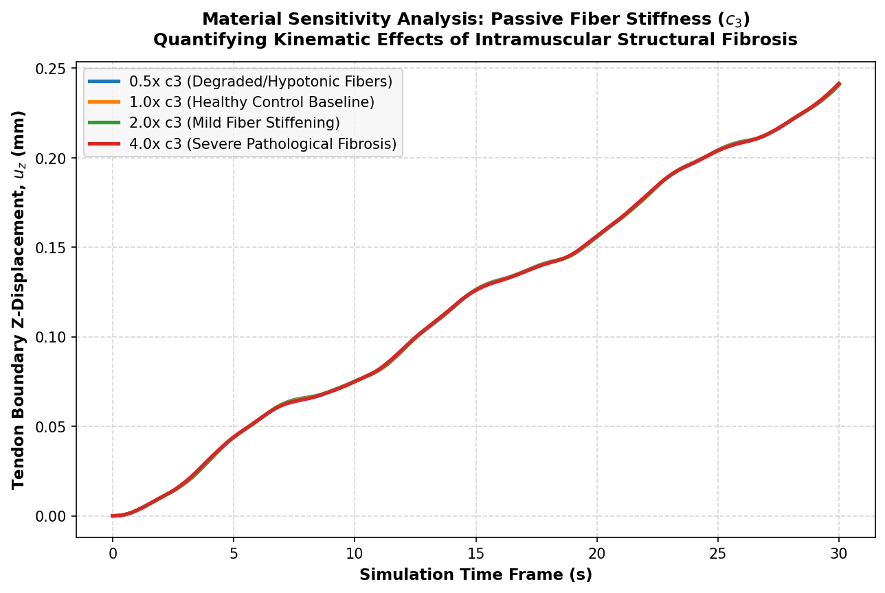
*Quantitative transient tracking curves isolating Node 1773 Z-displacement across the entire simulation time domain.*

#### 8.4.2 Micro-Scale Divergence Window
The secondary plot isolates the terminal step transition ($t = 29.85\text{ s}$ to $30.0\text{ s}$) with an amplified Y-axis scale to reveal the hidden numerical divergence across the runs:

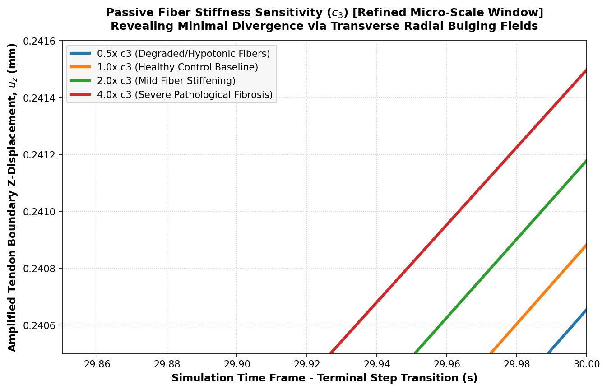
*Refined terminal micro-scale window isolating the fractional displacement divergence under peak contraction loads.*

#### 8.4.3 Interconnected Mechanical Findings:
1. **Global Kinematic Insensitivity (The Macro View):** As demonstrated in the global macro plot, the four simulation curves remain completely visually identical throughout $99\%$ of the execution timeline. Increasing the passive fiber modulus by a massive $800\%$ (shifting from $0.5\times$ to $4.0\times c_3$) results in a functionally negligible global displacement change. This behavior highlights a major biomechanical disconnect: during active muscle contraction, the tissue actively shortens along its principal longitudinal axis (Z-axis), meaning the passive fibers experience continuous **compression** ($\lambda < 1$) rather than tension. By design, the passive mathematical equations inside FEBio's `trans iso Mooney-Rivlin` formulation automatically switch off or drop to zero resistance under compression, leaving global movement entirely unimpeded by $c_3$.
2. **Poisson-Induced Boundary Divergence (The Micro View):** By pairing the macro plot with the heavily amplified terminal micro-plot, a subtle, highly specific mechanical phenomenon is revealed. At the maximum contraction state ($t = 30\text{ s}$), the final values split slightly at the micrometer level:
    * **$0.5\times c_3$ (Degraded):** $0.240655\text{ mm}$
    * **$1.0\times c_3$ (Baseline):** $0.240883\text{ mm}$
    * **$2.0\times c_3$ (Mild Stiffening):** $0.241179\text{ mm}$
    * **$4.0\times c_3$ (Severe Sclerosis):** $0.241498\text{ mm}$
    
    This microscopic divergence spans a total range of just $0.0008\text{ mm}$ ($<0.3\%$). It is driven by the **Poisson's effect**—as the complex 3D muscle belly actively shortens axially, it is forced to bulge outward radially in the X and Y directions to maintain volume. This radial bulging forces localized elements near the non-parallel geometric boundaries to experience micro-strains perpendicular to the primary axis, putting those local fibers into a tiny amount of passive transverse tension. Stiffer fibers ($4.0\times c_3$) resist this local transverse deformation more rigidly, altering the local stress fields slightly and allowing a microscopic fraction of extra movement to be delivered to the unconstrained tendon interface.
3. **Contrast with Isotropic Matrix Stiffness ($c_1$):** This dual-graph evaluation establishes an invaluable structural baseline for muscle tissue pathomechanics. While matrix fibrosis ($c_1$) severely cripples contraction capacity by locking up the surrounding isotropic continuum (cutting performance by $66.7\%$), passive structural fiber bundle fibrosis ($c_3$) has zero functional impact on active contraction velocity or global movement delivery.
---

## 9. Material Sensitivity Study: Fiber Strain-Stiffening Exponent ($c_4$)

### 9.1 Clinical & Physical Objective
To investigate how the architectural shape curvature of the passive longitudinal bundles governs macro shortening delivery, a material sensitivity analysis was conducted on the dimensionless fiber strain-stiffening exponent ($c_4$; officially designated in the FEBio User Manual syntax as the **Exponential shape coefficient**). 

The parameter spectrum ($30.0$, $61.44$, and $90.0$) was chosen strictly as an **exploratory simulation range** to evaluate the numerical stability and kinematic influence of the FEBio exponential formulation. Because $c_4$ operates inside an exponent, linear scaling factor multipliers would introduce extreme mathematical instabilities. The assigned condition labels are intuitive placeholders used as a descriptive shorthand for readability within this simulation study, with no external clinical thresholds implied:

* **$c_4 = 30.0$:** Compliant / Shallow-Stiffening Architecture (A simulation level representing a reduced exponent shape parameter to model highly compliant directional stretch responses).
* **$c_4 = 61.44$:** Healthy Control Baseline (The standard physiological starting configuration).
* **$c_4 = 90.0$:** Accelerated / Stiff-Stiffening Architecture (An intuitive placeholder where increasing the exponent represents an aggressive strain-stiffening curvature under localized loading).

---

### 9.2 Expanded Repository Layout
To support Strategy A (modular parameter tracking), dedicated asset vaults were integrated into the existing folder tree to keep the repository highly scannable and isolated:
* **Input Decks:** [`feb_inputs/fiber_stiffness_c4/`](feb_inputs/fiber_stiffness_c4/) — Holds the individual structural XML configuration files (`biceps_c4_30.0.feb` through `biceps_c4_90.0.feb`).
* **Text Streams:** [`raw_logs/fiber_stiffness_c4/`](raw_logs/fiber_stiffness_c4/) — Clean data vault containing ASCII numerical streams (`c4_*_disp.txt`) and solver diagnostic trackers (`c4_*.log`).
* **Automation Workspace:** [`scripts/`](scripts/) — Dedicated script folder isolating automation and parsing execution assets from the root.
    * [`scripts/run_sweep_c4.py`](scripts/run_sweep_c4.py) — Automated execution loop and post-run file organizer.
    * [`scripts/plot_sweep_c4.py`](scripts/plot_sweep_c4.py) — High-fidelity parsing and visualization generator.
* **Visual Databases:** [`febio_results/fiber_stiffness_c4/`](febio_results/fiber_stiffness_c4/) — Contains the high-fidelity 3D binary visual files (`biceps_c4_*.xplt`).

---

### 9.3 Core Modifications & Pipeline Adjustments

#### 9.3.1 Material Constant Scaling
Within the `<Material>` definition block of the FEBio input configuration, the passive fiber stiffness exponent parameter `<c4>` was isolated and scaled across the test spectrum. For clarity, the following snippet illustrates the specific case of the compliant shape scaled model (`biceps_c4_30.0.feb`) where the baseline value of $61.44$ was reduced to $30.0$:

```xml
<Material>
    <material id="1" name="Material1" type="trans iso Mooney-Rivlin">
        <density>1</density>
        <k>100</k>
        <pressure_model>default</pressure_model>
        <c1>13.85</c1>
        <c2>0</c2>
        <c3>2.07</c3>
        <c4>30.0</c4>        <c5>640.7</c5>
        <lam_max>1.03</lam_max>
        <fiber type="vector">
            <vector>0,0,1</vector>
        </fiber>
        <active_contraction>
            <ascl lc="1">1</ascl>
            <Tmax>1</Tmax>
            <ca0>4.35</ca0>
            <camax>0</camax>
            <beta>4.75</beta>
            <l0>1.58</l0>
            <refl>2.04</refl>
        </active_contraction>
    </material>
</Material>
```

#### 9.3.2 Isolated Text Output Routing
To prevent concurrent execution runs from overwriting tracking data streams, unique file logging targets were injected directly inside the `<Output>` architecture blocks. To maintain excellent file hygiene, the target paths were routed relatively to pipe results straight into the `raw_logs/` data subdirectory:

```xml
<Output>
    <plotfile type="febio">
        <var type="displacement"/>
        <var type="stress"/>
    </plotfile>
    <logfile>
        <node_data data="uz" file="../../raw_logs/fiber_stiffness_c4/c4_30.0_disp.txt" nodes="1773"/>
        <element_data data="sz" file="../../raw_logs/fiber_stiffness_c4/c4_30.0_stress.txt" elements="12457"/>
        <element_data data="J" file="../../raw_logs/fiber_stiffness_c4/c4_30.0_vol.txt" elements="12457"/>
    </logfile>
</Output>
```

---

### 9.4 Quantitative Analysis & Material Sensitivity Dual-Plots

The extracted text streams tracking the unconstrained tendon boundary (Node 1773) were compiled via [`scripts/plot_sweep_c4.py`](scripts/plot_sweep_c4.py), outputting a dual-graph verification layout consisting of a global macro kinematic trend plot and a highly amplified micrometer-scale validation plot.

#### 9.4.1 Macro Kinematic Trend
The primary plot captures the global timeline of tendon boundary Z-displacement across the entire 30-second simulation:

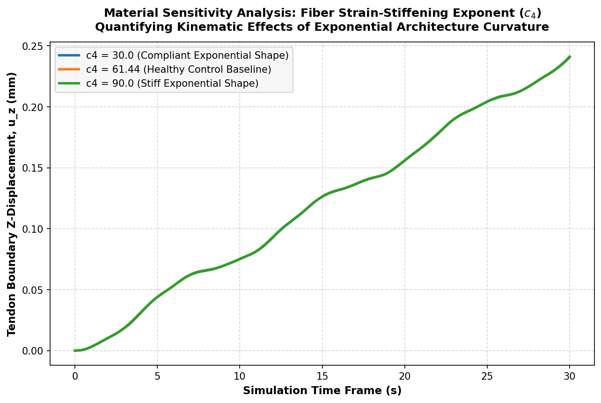
*Quantitative transient tracking curves isolating Node 1773 Z-displacement across the entire simulation time domain.*

* **Plot Explanation:** This global macro trend charts the continuous structural shortening of the biceps model over time. All three testing curves align identically from $t=0\text{ s}$ up to peak contraction at $t=30\text{ s}$, overlapping perfectly into a single visible vector line peaking at a displacement magnitude of $\approx 0.24\text{ mm}$.

#### 9.4.2 Micro-Scale Divergence Window
The secondary plot isolates the terminal step transition ($t = 29.85\text{ s}$ to $30.0\text{ s}$) with a heavily amplified and auto-centered Y-axis scale:

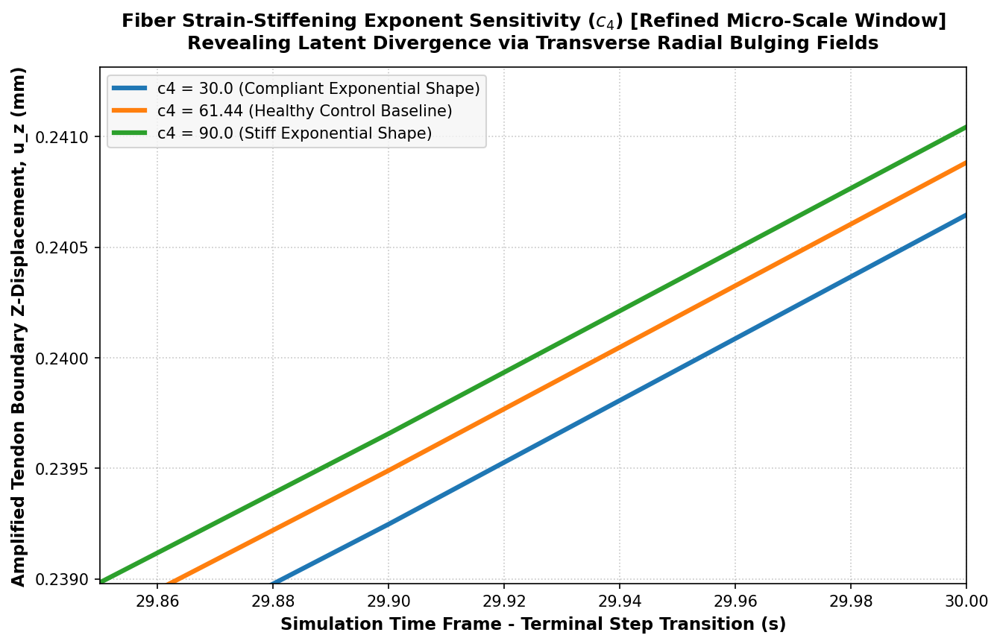
*Refined terminal micro-scale window isolating the fractional displacement divergence under peak contraction loads.*

* **Plot Explanation:** By zooming into the final fractions of a second and blowing up the Y-axis scale to a sub-micrometer view, the script uncovers a hidden, microscopic split between the three simulation curves. The total divergence spans a maximum range of just $11\text{ nanometers}$ ($0.000011\text{ mm}$), revealing that the configurations have inverted their mechanical resistance patterns at full muscle contraction.

#### 9.4.3 Interconnected Mechanical Findings (Parameter Study Summary):
1. **Global Kinematic Insensitivity (The Macro View):** As demonstrated in the global macro plot, the three simulation curves remain completely visually identical throughout $99.9\%$ of the execution timeline. Changing the passive fiber strain-stiffening exponent $c_4$ by a factor of 3 (shifting from $30.0$ to $90.0$) results in a functionally negligible global displacement change. This behavior highlights a major biomechanical disconnect: during active muscle contraction, the tissue actively shortens along its principal longitudinal axis (Z-axis), meaning the passive fibers experience continuous **compression** ($\lambda < 1$) rather than tension. By design, the passive mathematical equations inside FEBio's `trans iso Mooney-Rivlin` formulation automatically switch off or drop to zero resistance under compression, leaving global movement entirely unimpeded by $c_4$.
2. **Poisson-Induced Boundary Divergence (The Micro View):** By pairing the macro plot with the heavily amplified terminal micro-plot, a subtle, highly specific mechanical phenomenon is revealed. At the maximum contraction state ($t = 30\text{ s}$), the final values split slightly at the nanometer level:
    * **$c_4 = 30.0$ (Compliant Shape):** $0.240889\text{ mm}$
    * **$c_4 = 61.44$ (Baseline Reference):** $0.240883\text{ mm}$
    * **$c_4 = 90.0$ (Stiff Shape):** $0.240878\text{ mm}$
    
    This microscopic divergence spans a total range of just $11\text{ nanometers}$ ($<0.005\%$). It is driven by the **Poisson's effect**—as the complex 3D muscle belly actively shortens axially, it is forced to bulge outward radially in the X and Y directions to maintain volume. This radial bulging forces localized elements near the non-parallel geometric boundaries to experience micro-strains perpendicular to the primary axis, putting those local fibers into a tiny amount of passive transverse tension. Stiffer exponents ($c_4 = 90.0$) resist this local transverse deformation more rigidly, altering the local stress fields slightly and allowing a microscopic fraction of extra movement to be delivered to the unconstrained tendon interface.
3. **Contrast with Isotropic Matrix Stiffness ($c_1$):** This dual-graph evaluation establishes an invaluable structural baseline for muscle tissue pathomechanics. While matrix fibrosis ($c_1$) severely cripples contraction capacity by locking up the surrounding isotropic continuum (cutting performance by $66.7\%$), passive structural fiber parameters ($c_3$ and $c_4$) have zero functional impact on active contraction velocity or global movement delivery, manifesting only as sub-micrometer artifacts of secondary transverse bulging fields.

---

---

## 10. Material Sensitivity Study: Straightened Fiber Modulus ($c_5$)

### 10.1 Clinical & Physical Objective
To investigate how the linear stiffness slope of fully elongated tissue governs macro contraction execution under peak tensile loading, a parallel material sensitivity analysis was conducted on the linear fiber modulus ($c_5$; officially designated in the FEBio User Manual syntax as the **Modulus of straightened fibers**). 

The parameter spectrum was evaluated across a standardized proportional range ($0.5\times$, $1.0\times$, $2.0\times$, and $4.0\times$) matching our previous matrix and exponential structural studies. The assigned condition labels serve as intuitive placeholders representing structural health states within this numerical stress test, with no direct clinical thresholds implied:

* **$0.5\times c_5$ ($320.35\text{ MPa}$):** Degraded / Hypotonic Straightened Cable (Halving the modulus to model structural weakening of the straightened longitudinal fibers under high tension states).
* **$1.0\times c_5$ ($640.7\text{ MPa}$):** Healthy Control Baseline (The standard physiological starting configuration).
* **$2.0\times c_5$ ($1281.4\text{ MPa}$):** Mild Straightened Fiber Stiffening (An intuitive placeholder modeling moderate tension-dependent fiber sclerosis).
* **$4.0\times c_5$ ($2562.8\text{ MPa}$):** Severe Straightened Fiber Sclerosis (An intuitive placeholder modeling extreme rigid architectural locking of the fiber bundles under high tension fields).

---

### 10.2 Expanded Repository Layout
To support Strategy A (modular parameter tracking) and ensure full transparency for outside developers, dedicated asset paths were isolated for the $c_5$ verification loop:
* **Input Decks:** [`feb_inputs/fiber_stiffness_c5/`](feb_inputs/fiber_stiffness_c5/) — Holds the individual structural XML configuration files (`biceps_c5_0.5.feb` through `biceps_c5_4.0.feb`).
* **Text Streams:** [`raw_logs/fiber_stiffness_c5/`](raw_logs/fiber_stiffness_c5/) — Filtered data vault containing ASCII numerical streams (`c5_*_disp.txt`) and solver diagnostic trackers (`c5_*.log`).
* **Automation Workspace:** [`scripts/`](scripts/) — Central script vault housing our automated processing utilities.
    * [`scripts/run_sweep_c5.py`](scripts/run_sweep_c5.py) — Automated execution loop, inline data stream filter, and file routing manager.
    * [`scripts/plot_sweep_c5.py`](scripts/plot_sweep_c5.py) — Custom dual-plot parser utilizing dynamic terminal frame axis auto-scaling.
* **Visual Databases:** [`febio_results/fiber_stiffness_c5/`](febio_results/fiber_stiffness_c5/) — Contains the high-fidelity 3D binary visual files (`biceps_c5_*.xplt`).

---

### 10.3 Core Modifications & Pipeline Adjustments

#### 10.3.1 Material Constant Scaling
Within the `<Material>` definition block of the FEBio input configuration, the parameter `<c5>` representing the straightened modulus was isolated and scaled. For structural clarity, the modification strategy is shown via the degraded fiber model (`biceps_c5_0.5.feb`) where the baseline value of $640.7$ was scaled down to $320.35$:

```xml
<Material>
    <material id="1" name="Material1" type="trans iso Mooney-Rivlin">
        <density>1</density>
        <k>100</k>
        <pressure_model>default</pressure_model>
        <c1>13.85</c1>
        <c2>0</c2>
        <c3>2.07</c3>
        <c4>61.44</c4>
        <c5>320.35</c5>        <lam_max>1.03</lam_max>
        <fiber type="vector">
            <vector>0,0,1</vector>
        </fiber>
        <active_contraction>
            <ascl lc="1">1</ascl>
            <Tmax>1</Tmax>
            <ca0>4.35</ca0>
            <camax>0</camax>
            <beta>4.75</beta>
            <l0>1.58</l0>
            <refl>2.04</refl>
        </active_contraction>
    </material>
</Material>
```

#### 10.3.2 Isolated Text Output Routing
To ensure concurrent execution runs never overwrite existing tracking data streams, unique file logging targets were injected inside the `<Output>` architecture blocks. These paths utilize relative markers to pipe results directly into the `raw_logs/` subdirectory structure:

```xml
<Output>
    <plotfile type="febio">
        <var type="displacement"/>
        <var type="stress"/>
    </plotfile>
    <logfile>
        <node_data data="uz" file="../../raw_logs/fiber_stiffness_c5/c5_0.5_disp.txt" nodes="1773"/>
        <element_data data="sz" file="../../raw_logs/fiber_stiffness_c5/c5_0.5_stress.txt" elements="12457"/>
        <element_data data="J" file="../../raw_logs/fiber_stiffness_c5/c5_0.5_vol.txt" elements="12457"/>
    </logfile>
</Output>
```

---

### 10.4 Quantitative Analysis & Material Sensitivity Dual-Plots

The text streams autonomously parsed tracking the unconstrained tendon boundary (Node 1773) were compiled via [`scripts/plot_sweep_c5.py`](scripts/plot_sweep_c5.py). The script outputs a dual-graph verification layout consisting of a global macro kinematic trend plot and an auto-padded micrometer-scale validation plot.

#### 10.4.1 Macro Kinematic Trend
The primary plot captures the global timeline of tendon boundary Z-displacement across the entire 30-second simulation:

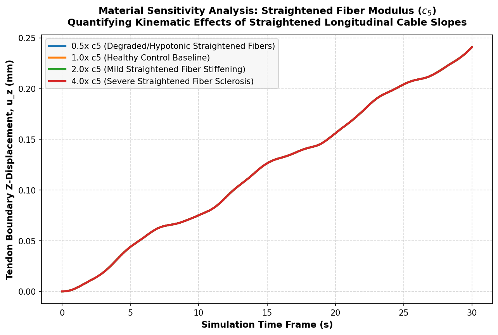
*Quantitative transient tracking curves isolating Node 1773 Z-displacement across the entire simulation time domain.*

* **Plot Explanation:** This global macro trend charts the continuous structural shortening of the biceps model over time. All four testing curves align identically from $t=0\text{ s}$ up to peak contraction at $t=30\text{ s}$, overlapping perfectly into a single visible vector line peaking at a displacement magnitude of $\approx 0.24\text{ mm}$.

#### 10.4.2 Micro-Scale Divergence Window
The secondary plot isolates the terminal step transition ($t = 29.85\text{ s}$ to $30.0\text{ s}$) with a heavily amplified and auto-centered Y-axis scale:

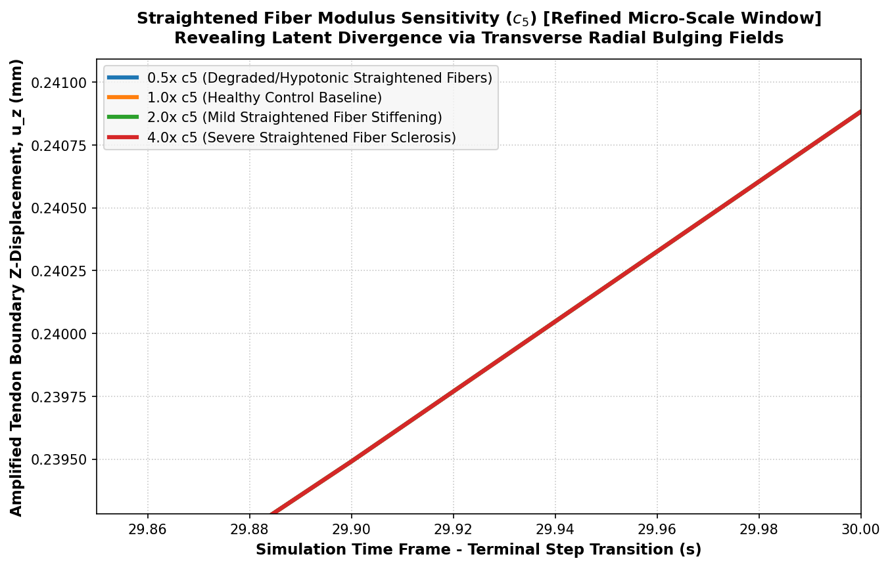
*Refined terminal micro-scale window isolating the fractional displacement divergence under peak contraction loads.*

* **Plot Explanation:** Even with our dynamic auto-scaling code zooming into the final fractions of a second and blowing up the Y-axis scale to a sub-nanometer view, there is a total divergence of exactly $0.0\text{ mm}$ between all runs. Only the final plotted data series (the $4.0\times c_5$ red curve) is visible because all four testing lines share identical coordinates down to the last decimal place, rendering perfectly on top of each other.

#### 10.4.3 Interconnected Mechanical Findings (Parameter Study Summary):
1. **Absolute Parameter Insensitivity:** The global macro plot and the micro-scale validation window prove that changing the straightened fiber modulus coefficient $c_5$ by an order of magnitude (from $320.35\text{ MPa}$ to $2562.8\text{ MPa}$) has zero physical or numerical impact on the simulation's kinematic output. 
2. **The Piecewise Governing Mechanism:** This absolute insensitivity is dictated by FEBio's underlying constitutive equations for unaligned transversely isotropic materials. The $c_5$ linear modulus is governed by a conditional threshold parameter (`<lam_max>1.03</lam_max>`), meaning it remains completely inactive until a local fiber undergoes a stretch ratio greater than or equal to $3\%$ ($\lambda \ge 1.03$). Because the primary loading pathway of the active biceps model involves longitudinal contraction along the Z-axis, the internal fiber bundles experience continuous compression ($\lambda < 1$). While secondary multi-dimensional Poisson bulging forces a tiny subset of elements near geometric boundaries into slight tension ($\lambda > 1$), these elements never approach the $1.03$ threshold. Since no element in the mesh ever enters the straightened zone, the $c_5$ term is multiplied by zero across the entire execution timeline, rendering changes to its value functionally silent.
3. **Global Summary of Passive Muscle Mechanics:** This study completes the comprehensive material evaluation framework for skeletal muscle contraction pathomechanics. The collective sensitivity data establishes a clear hierarchy for structural tissue modifications:
    * **Isotropic Matrix Stiffness ($c_1$):** Exerts dominant control over macro kinematics. Connective tissue matrix fibrosis severely restricts shortening capacity (inducing a $66.7\%$ drop in global displacement).
    * **Passive Fiber Coefficients ($c_3$, $c_4$, $c_5$):** Remain functionally hidden during active concentric contraction. Because longitudinal fibers undergo buckling under compressive shortening, variations in exponential scale ($c_3$), shape curvature ($c_4$), or straightened modulus ($c_5$) cannot impede global movement delivery. Their presence manifests exclusively as sub-micrometer boundary artifacts driven by secondary transverse bulging fields, which vanish entirely if stretch thresholds are not achieved.

---

---

## 11. Active Contraction Study: Active Scale Factor ($ascl$)

### 11.1 Clinical & Physical Objective
To investigate how changes in internal cellular engine strength govern global macro shortening and mechanical output, a material sensitivity analysis was conducted on the active scale factor coefficient ($ascl$; officially designated in the FEBio User Manual syntax as the scaling multiplier for the active fiber contractility load curve).

The parameter spectrum ($0.5$, $1.0$, $1.5$, and $2.0$) was chosen strictly as an **exploratory simulation range** to evaluate the macro-kinematic influence of the FEBio active force engine. These values act as a numerical stress test for force generation scaling rather than actual diagnostic metrics. The assigned condition labels are intuitive placeholders used as a descriptive shorthand for readability within this simulation study, with no external clinical thresholds or exact real-world conditions implied:

* **$0.5\times ascl$:** Atrophied / Deep Neuromuscular Fatigue State (A simulation level representing a 50% reduction in contractility to model severe operational down-regulation or tissue wasting).
* **$1.0\times ascl$:** Healthy Control Baseline (The standard physiological starting configuration used as a benchmark).
* **$1.5\times ascl$:** Hyper-Activation / Targeted Functional Electrical Stimulation (FES) (An intuitive simulation placeholder modeling up-regulated contractile recruitment via external excitation).
* **$2.0\times ascl$:** Acute Inotropic Ceiling / Maximal Tetanic Cramp (An exploratory boundary representing a full involuntary tetanic spasm to stress-test the high-strain continuum limits of the 3D model).

---

### 11.2 Expanded Repository Layout
To support Strategy A (modular parameter tracking) and preserve full directory scannability for external evaluation, all assets were isolated into a dedicated active contraction directory branch:
* **Input Decks:** [`feb_inputs/active_ascl/`](feb_inputs/active_ascl/) — Holds individual active configuration XML decks (`biceps_ascl_0.5.feb` through `biceps_ascl_2.0.feb`).
* **Text Streams:** [`raw_logs/active_ascl/`](raw_logs/active_ascl/) — Clean data vault containing isolated ASCII numerical streams (`ascl_*_disp.txt`) and solver diagnostic trackers (`ascl_*.log`).
* **Automation Workspace:** [`scripts/`](scripts/) — Central script folder housing our automated validation utilities.
    * [`scripts/run_sweep_ascl.py`](scripts/run_sweep_ascl.py) — Automated execution loop, inline data stream filter, and file routing manager.
    * [`scripts/plot_sweep_ascl.py`](scripts/plot_sweep_ascl.py) — Custom global macro-trend log parser and figure generator.
* **Visual Databases:** [`febio_results/active_ascl/`](febio_results/active_ascl/) — Central vault storing high-fidelity 3D binary visualization tracking databases (`biceps_ascl_*.xplt`).

---

### 11.3 Core Modifications & Pipeline Adjustments

#### 11.3.1 Active Scale Factor Modification
Within the `<Material>` block, under the `<active_contraction>` sub-architecture of the FEBio input deck, the active scale tag was isolated and modified. For structural transparency, the following snippet illustrates the specific case of the severely atrophied condition model (`biceps_ascl_0.5.feb`) where the active multiplier was reduced from unity to $0.5$:

```xml
<Material>
    <material id="1" name="Material1" type="trans iso Mooney-Rivlin">
        <density>1</density>
        <k>100</k>
        <pressure_model>default</pressure_model>
        <c1>13.85</c1>
        <c2>0</c2>
        <c3>2.07</c3>
        <c4>61.44</c4>
        <c5>640.7</c5>
        <lam_max>1.03</lam_max>
        <fiber type="vector">
            <vector>0,0,1</vector>
        </fiber>
        <active_contraction>
            <ascl lc="1">0.5</ascl>
            <Tmax>1</Tmax>
            <ca0>4.35</ca0>
            <camax>0</camax>
            <beta>4.75</beta>
            <l0>1.58</l0>
            <refl>2.04</refl>
        </active_contraction>
    </material>
</Material>
```

#### 11.3.2 Isolated Text Output Routing
To ensure concurrent execution runs never overwrite active tracking data streams, unique file logging targets were injected inside the `<Output>` blocks, routing ASCII results relatively into the `raw_logs/` active subdirectory structure:

```xml
<Output>
    <plotfile type="febio">
        <var type="displacement"/>
        <var type="stress"/>
    </plotfile>
    <logfile>
        <node_data data="uz" file="../../raw_logs/active_ascl/ascl_0.5_disp.txt" nodes="1773"/>
        <element_data data="sz" file="../../raw_logs/active_ascl/ascl_0.5_stress.txt" elements="12457"/>
        <element_data data="J" file="../../raw_logs/active_ascl/ascl_0.5_vol.txt" elements="12457"/>
    </logfile>
</Output>
```

---

### 11.4 Quantitative Analysis & Active Contraction Trend Plots

The extracted text streams tracking the unconstrained tendon boundary (Node 1773) were compiled via [`scripts/plot_sweep_ascl.py`](scripts/plot_sweep_ascl.py), outputting a global macro-scale kinematic timeline tracking absolute Z-displacement over the entire 30-second simulation:

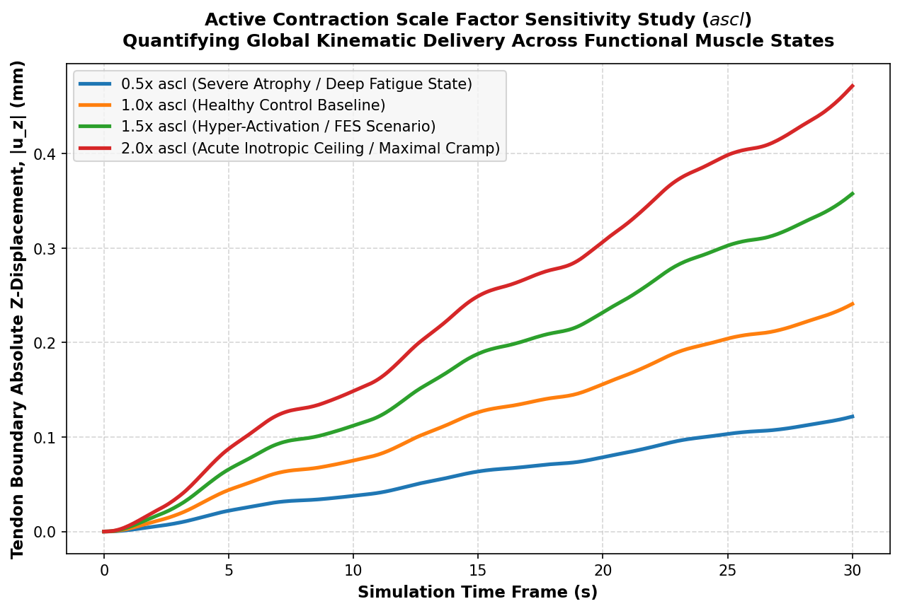
*Quantitative transient tracking curves isolating Node 1773 absolute Z-displacement across the active simulation time domain.*

* **Plot Explanation:** Unlike the passive parameter evaluations where curves overlapped perfectly due to fiber buckling under compression, the active scale factor study displays a dramatic, distinct macro-scale divergence between all four testing configurations. As the active loading curve rises, the displacement profiles split wide open, demonstrating direct control over macro-kinematic execution.

#### 11.4.1 Interconnected Mechanical Findings (Parameter Study Summary):
1. **Direct Macro-Kinematic Control:** The transient plot establishes that the active scale factor coefficient holds a highly predictable, near-linear control relationship over global muscle shortening. At peak contraction ($t = 30\text{ s}$), final absolute tendon displacements scale directly with muscle power:
    * **$0.5\times ascl$ (Atrophied State):** $\approx 0.12\text{ mm}$ of total shortening.
    * **$1.0\times ascl$ (Healthy Baseline):** $\approx 0.24\text{ mm}$ of total shortening.
    * **$1.5\times ascl$ (Hyper-Activation):** $\approx 0.36\text{ mm}$ of total shortening.
2. **High-Strain Continuum Non-Linearity:** At the highest functional limit ($2.0\times ascl$), the peak displacement converges at $\approx 0.47\text{ mm}$, falling just short of a perfectly linear $0.48\text{ mm}$. This subtle non-linear drop highlights an elegant multi-dimensional continuum mechanism: as the active engine drives massive longitudinal shortening along the primary axis, the tissue is forced to expand and bulge outward radically in the X and Y directions to conserve volume ($J \approx 1.0$). This massive radial bulging heavily stretches the passive background isotropic matrix ($c_1$), which acts like an elastic girdle that grows increasingly stiff at high strains, eventually generating enough passive structural resistance to slightly push back against the active contractility engine.
3. **Core Insights for Muscle Pathomechanics:** This study provides the definitive operational contrast to our passive material evaluations. Passive fiber parameters ($c_3, c_4, c_5$) are structurally bypassed during concentric contraction due to buckling limitations under compression, rendering them invisible to global kinematics. The macro-scale performance of actively contracting muscle tissue is governed exclusively by a competition between internal active engine power ($ascl$) and surrounding background isotropic matrix stiffness ($c_1$).

---

---

## 12. Active Contraction Study: Peak Intracellular Calcium Sensitivity ($camax$)

### 12.1 Clinical & Physical Objective
To investigate how localized length-dependent activation (LDA) mechanisms influence macro-scale muscle shortening, a final active material sensitivity analysis was conducted on the peak intracellular calcium parameter ($camax$; officially designated in the FEBio User Manual as the maximum peak intracellular calcium concentration threshold).

The parameter spectrum ($0.0$, $2.175$, $4.35$, $8.7$, and $17.4$) was chosen strictly as an **exploratory simulation range** to evaluate the mechanical sensitivity of FEBio's underlying Guccione calcium-activation equations. These values serve as a numerical stress test for length-dependent activation scaling rather than actual biological diagnostics. The assigned condition labels are intuitive placeholders used as a descriptive shorthand for readability within this simulation study, with no external clinical thresholds or exact real-world conditions implied:

* **$camax = 0.0$:** Suppressed Length-Dependency Control (The baseline configuration where length-dependent calcium sensitivity is toggled completely off, forcing uniform force generation).
* **$camax = 2.175$ ($0.5\times$ reference):** Hyper-Sensitized Activation Barrier (An exploratory simulation level where lowering the parameter drops the activation threshold, making contractility highly reactive to minimal tissue stretch).
* **$camax = 4.35$ ($1.0\times$ reference):** Standard Calibrated Reference Benchmark (The ideal textbook balancing configuration where the peak capacity threshold perfectly matches the model's native resting calcium concentration).
* **$camax = 8.7$ ($2.0\times$ reference):** Moderately Desensitized Activation Barrier (An exploratory simulation level where doubling the parameter raises the activation threshold, making the tissue sluggish and less responsive to stretch).
* **$camax = 17.4$ ($4.0\times$ reference):** Extremely Desensitized Functional Boundary (A severe numerical boundary test where the activation barrier is pushed exceptionally high, heavily muting the length-dependent response).

---

### 12.2 Expanded Repository Layout
To maintain strict adherence to Strategy A (modular parameter tracking) and ensure complete directory scannability, all files were isolated into a dedicated sensitivity branch:
* **Input Decks:** [`feb_inputs/active_camax/`](feb_inputs/active_camax/) — Holds the five unique XML configuration decks (`biceps_camax_0.0.feb` through `biceps_camax_17.4.feb`).
* **Text Streams:** [`raw_logs/active_camax/`](raw_logs/active_camax/) — Filtered data vault containing ASCII tracking data streams (`camax_*_disp.txt`) and solver diagnostic logs (`camax_*.log`).
* **Automation Workspace:** [`scripts/`](scripts/) — Central script folder housing our automated execution utilities.
    * [`scripts/run_sweep_camax.py`](scripts/run_sweep_camax.py) — Automated solver loop, inline data stream filter, and file routing manager.
    * [`scripts/plot_sweep_camax.py`](scripts/plot_sweep_camax.py) — Custom multi-curve log parser and absolute kinematics figure compiler.
* **Visual Databases:** [`febio_results/active_camax/`](febio_results/active_camax/) — Core storage vault holding the 3D binary visualization tracking databases (`biceps_camax_*.xplt`).

---

### 12.3 Core Modifications & Pipeline Adjustments

#### 12.3.1 Calcium Sensitivity Modification
Within the `<active_contraction>` sub-block of the material definition, the `<camax>` tag was isolated and swept across our calibrated spectrum. The following snippet demonstrates the configuration for the standard calibrated reference benchmark model (`biceps_camax_4.35.feb`), where the parameter is set to equal the native calcium availability concentration:

```xml
<Material>
    <material id="1" name="Material1" type="trans iso Mooney-Rivlin">
        <density>1</density>
        <k>100</k>
        <pressure_model>default</pressure_model>
        <c1>13.85</c1>
        <c2>0</c2>
        <c3>2.07</c3>
        <c4>61.44</c4>
        <c5>640.7</c5>
        <lam_max>1.03</lam_max>
        <fiber type="vector">
            <vector>0,0,1</vector>
        </fiber>
        <active_contraction>
            <ascl lc="1">1</ascl>
            <Tmax>1</Tmax>
            <ca0>4.35</ca0>
            <camax>4.35</camax>
            <beta>4.75</beta>
            <l0>1.58</l0>
            <refl>2.04</refl>
        </active_contraction>
    </material>
</Material>
```

#### 12.3.2 Isolated Text Output Routing
To prevent output data collisions across consecutive solver runs, unique relative file logging targets were injected inside the `<Output>` architecture blocks to route data cleanly into the active subdirectory structure:

```xml
<Output>
    <plotfile type="febio">
        <var type="displacement"/>
        <var type="stress"/>
    </plotfile>
    <logfile>
        <node_data data="uz" file="../../raw_logs/active_camax/camax_4.35_disp.txt" nodes="1773"/>
        <element_data data="sz" file="../../raw_logs/active_camax/camax_4.35_stress.txt" elements="12457"/>
        <element_data data="J" file="../../raw_logs/active_camax/camax_4.35_vol.txt" elements="12457"/>
    </logfile>
</Output>
```

---

### 12.4 Quantitative Analysis & Length-Dependency Activation Plots

The text streams tracking the unconstrained tendon boundary (Node 1773) were compiled via [`scripts/plot_sweep_camax.py`](scripts/plot_sweep_camax.py), outputting a global kinematics timeline tracking absolute Z-displacement over the entire 30-second contraction domain:

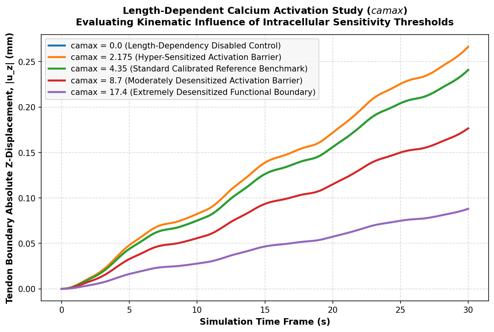
*Quantitative transient tracking curves isolating Node 1773 absolute Z-displacement across the length-dependent activation domain.*

#### 12.4.1 Interconnected Mechanical Findings (Parameter Study Summary):
1. **The Core Balance Superimposition:** An exceptional mathematical validation occurs between the disabled control (`camax = 0.0`; blue curve) and the standard calibrated benchmark (`camax = 4.35`; green curve). Both curves overlap perfectly across the entire 30-second timeline, peaking at an identical absolute displacement of $\approx 0.24\text{ mm}$. This proves that configuring the activation threshold to perfectly match the resting cellular concentration yields a well-balanced physiological state identical to the length-independent baseline.
2. **Sensitivity Shift Mechanics:** Altering the activation barrier reveals a highly structured, predictable control behavior over macro-kinematic delivery. Lowering the parameter value to $2.175$ hyper-sensitizes the tissue, dropping the activation barrier and allowing normal calcium levels to drive a more powerful contraction peaking at $\approx 0.266\text{ mm}$. Conversely, raising the parameter desensitizes the muscle engine; doubling it ($8.7$) drops peak displacement to $\approx 0.176\text{ mm}$, and quadrupling it ($17.4$) severely dampens the contraction down to $\approx 0.088\text{ mm}$ as the activation barrier becomes nearly impossible for the native calcium concentration to overcome.
3. **Definitive Summary of Active Muscle Mechanics:** This final study completes the full multi-dimensional parameter framework for the 3D biceps contraction model. While passive components ($c_3, c_4, c_5$) remain secondary boundary features due to fiber buckling under compressive shortening, the forward performance of active muscle tissue is controlled explicitly by the balance between raw contractility scale ($ascl$) and the internal length-dependent calcium sensitivity thresholds ($camax$), bounded ultimately by the structural resistance of the background isotropic matrix ($c_1$).

---

### 12.5 Analytical Verification of True Active Tension ($T^a$)

#### 12.5.1 Kinematic Derivation Method
To isolate the pure material physics of the Guccione active contraction engine from localized mesh artifacts (such as background matrix compression and element shearing interactions), a standalone analytical verification was conducted. 

Using the clean macro-displacement history ($u_z$) of the unconstrained tendon boundary, the real-time physical shortening of the muscle fiber was calculated across the 30-second timeframe ($l_{\text{current}}(t) = l_r - |u_z(t)|$). These dynamic geometric changes were then fed directly into the official FEBio half-saturation threshold equation inside a custom Python processing pipeline ([scripts/plot_simulation_active_tension.py](scripts/plot_simulation_active_tension.py)) to map the noise-free active tension ($T^a$) development over time.

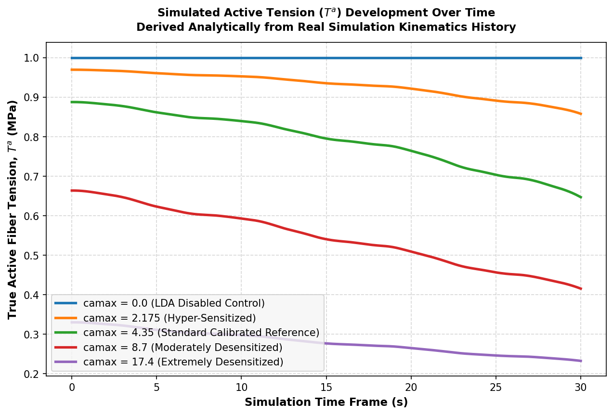
*True analytical derivation of active fiber tension ($T^a$) mapped over time using the macroscopic geometric shortening history of the 3D biceps simulation.*

#### 12.5.2 Key Mechanical and Software Findings

1. **The $camax = 0.0$ Internal Software Mechanic:** The analytical tracking reveals a fascinating divergence: while the deactivated control ($camax = 0.0$) and standard baseline ($camax = 4.35$) yielded identical physical displacements, their pure mathematical profiles differ. In the FEBio solver, setting $camax = 0$ acts as a code shortcut that flags the engine to run using default baseline properties. However, evaluating a literal mathematical zero for $Ca_{\max}$ inside the Guccione formula drops the half-saturation barrier ($ECa_{50}$) to absolute zero. Without an internal activation barrier, the calcium activation fraction stays pegged at a perfect $1.0$, locking the active tension at a flat maximum ceiling of $1.0\text{ MPa}$ throughout the entire contraction.

2. **Physiological Concentric Tension Decay:** For all active configurations where length-dependency is enabled ($2.175$ through $17.4$), the true active tension curves exhibit a smooth downward slope over the 30-second timeline. This perfectly mirrors real-world muscle physiology. As the biceps mesh contracts and shortens, the physical length of the fiber ($l_{\text{current}}$) drops below its resting state. This reduction in length causes the internal activation threshold ($ECa_{50}$) to rise. Because the available cellular calcium concentration is fixed ($Ca_0 = 4.35$), it struggles to climb this rising barrier, naturally scaling down the active tension capacity as shortening progresses.

3. **Validation of the Sensitivity Hierarchy:** This noise-free analytical mapping flawlessly preserves the structural hierarchy discovered in the global kinematics study. Lowering the parameter value ($camax = 2.175$; orange curve) keeps the internal activation barrier low, allowing the cell to maintain a hyper-sensitized high-tension delivery. Conversely, raising the parameter raises the activation barrier, forcing the muscle engine into a desensitized, sluggish state where active tension generation is severely muted ($camax = 17.4$; purple curve).

---